# WEEK 2 REPORT

#### Colab Running Test
Successfully copy and run the `4.Fourth Run` and `5.Tile With Saturation` on Colab with following hyperparameters and results:
- --img 1024 --batch 16 --epochs 10
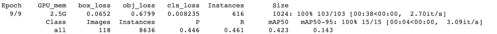
- --img 416 --batch 32 --epochs 40
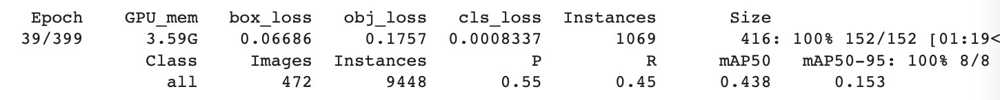

#### Discovery Cluster Running Test
Successfully start a GPU instance on Cluster, and upload and run the jupyter notebooks on JupyterNotebook Lab. The GPU model is Tesla V100-SXM2-32GB with CUDA 11.7.

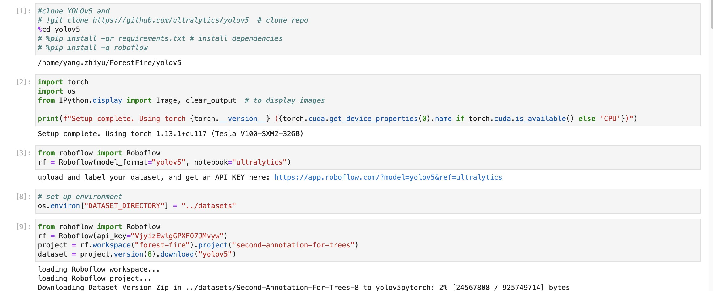

Hyperparameters:  

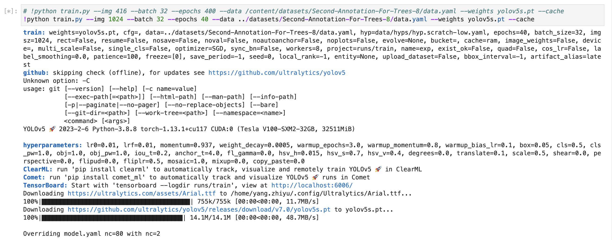

Training result:  

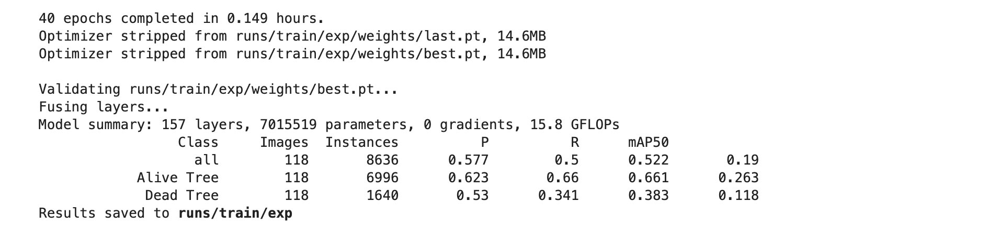

#### Potential Problem - Trees are too small
Most of our dataset's images are large and high resolution (3000x2000). The previous trainings picked a mostly used value 416 or 512 as the image size. However, this value might miss a lot of information and impact the detection rate in our dataset, since each tree is comparably small in an image.

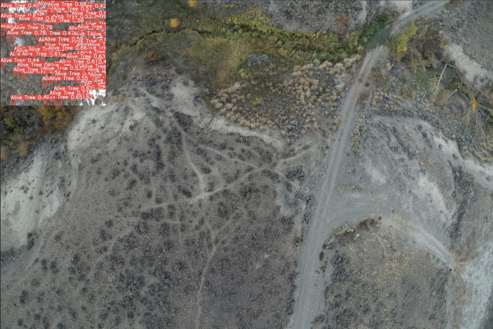
[640 x 640 in 3000 x 2000]

##### How to detect small object?
- [How to Detect Small Objects: A Guide](https://blog.roboflow.com/detect-small-objects/)
    - Increasing your image capture resolution
    - **Increasing your model's input resolution**
    - Tiling your images
    - Generating more data via augmentation
    - Auto learning model anchors
    - Filtering out extraneous classes  

- [Small Object Detection: An Image Tiling Based Approach](https://binginagesh.medium.com/small-object-detection-an-image-tiling-based-approach-bce572d890ca)
- [Launch: Edge Tiling During Inference](https://blog.roboflow.com/edge-tiling-during-inference/)

#### Approach 1 - Increase model's input resolution

##### Result Comparison: 416 vs 1024
Precison, recall and mAP50 all got improved just by 40 epochs training, compared with the `Fourth Run` and 171 epochs.  
  
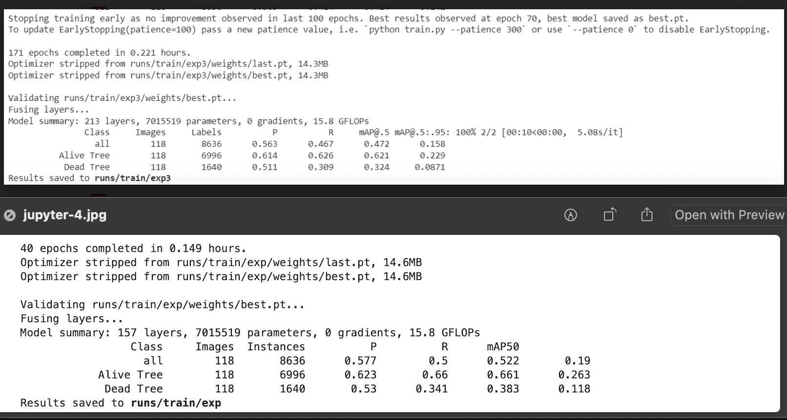

Prediction Visual Comparison:
Left - 416    :   Right - 1024
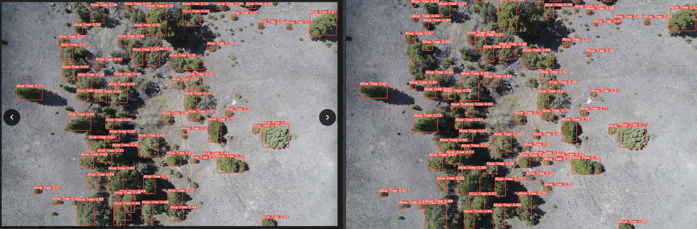
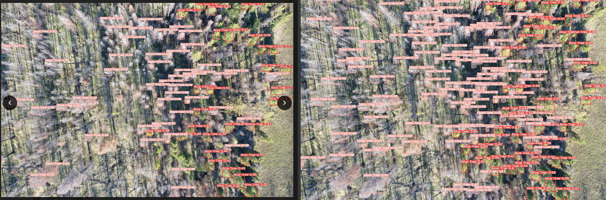
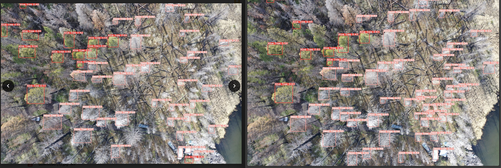
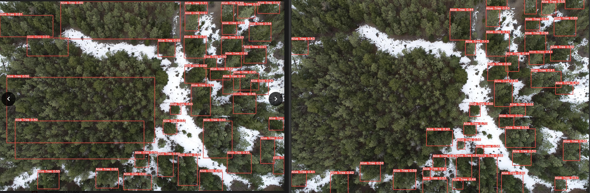
